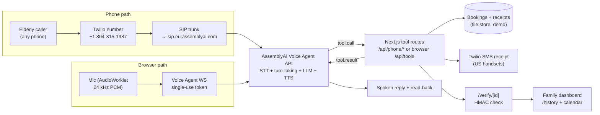

# SilverLine — the voice line that waits

> AssemblyAI Voice Agent Hackathon entry (lablab.ai, Sep 1–30 2026).
> Live: **https://silverline-voice.vercel.app** · Phone: **+1 (804) 315-1987**

Every voice bot hangs up on Grandma first — it mistakes thinking for finished.
SilverLine is a slow-safe voice companion for elderly patients: it confirms
clinic visits and medications over a plain phone call, then gives the family a
**signed receipt** proving it happened right.

## Thesis

**What.** A patient voice line. Elderly patients call one number (or tap once
in a browser) and a slow, warm agent confirms their visit, teaches back their
medications, and issues a verifiable receipt the family can check.

**Why.** Voice AI spent 2026 optimizing for *lower latency*. The fastest-growing
user base — adults over 70, many on plain phones, many with slow, hesitant
speech — needs *higher tolerance*. Default bots cut them off, mangle drug
names, and leave zero proof, so families call on their behalf and clinics drown
in phone tag. Slowness is the feature.

**How.** Patience engineered, not promised:
1. **Slow-safe turn-taking** — 1200/3500 ms silence envelope + semantic
   interruption handling, so pauses are waited through, never punished.
2. **Drug-name-accurate hearing** — per-stage keyterm narrowing (clinic names →
   drug names) via live `session.update`, no reconnect.
3. **Proof-gated action** — nothing books without a slow read-back and an
   explicit "yes"; every call ends in an HMAC-signed receipt with a public
   verify page where any edit breaks verification.

## Live proof (Sep 22 2026)

A real 8-minute PSTN call to +1 (804) 315-1987 produced a real booking and a
valid signed receipt (3/3 meds teach-back). Full log: [`proof/`](proof/).
It also taught us something: EU-pinned accounts must point the SIP trunk at
`sip.eu.assemblyai.com` — the US ingress answers 503 for EU-registered numbers.

## Architecture



## How AssemblyAI is used

| Capability | Where | Why it matters |
|---|---|---|
| Voice Agent API (managed WS) | browser + phone | single connection: STT + turn detection + LLM + TTS, PCI-certified |
| Patient turn-taking (`min_silence` 1200 / `max_silence` 3500) | `src/lib/agent.ts` | the wedge: hesitant speech never cut off; toggleable live |
| Semantic interruption handling | `VoiceCall.tsx` | backchannels ("mhm") don't kill replies; only real barge-in flushes |
| Dynamic `keyterms` + `transcription_prompt` | per-stage `session.update` | clinic names, then drug names like *Metoprolol succinate* |
| Function tools (browser) / HTTP tools (phone) | 5 tools | availability, transactional booking, meds, teach-back, receipts |
| Single-use token mint | `/api/token` | API key never reaches the browser |
| Session hygiene (`session.end`, resume) | client | no billed 30s grace windows |

## How Twilio is used

| Piece | Detail |
|---|---|
| Number | +1 (804) 315-1987, voice + SMS |
| SIP trunk | `silverline-voice.pstn.twilio.com` → origination `sip.eu.assemblyai.com` (priority 1), US ingress fallback |
| SMS receipts | `issue_receipt` accepts `receipt_phone`; US delivery standard (note: Vietnam routes are carrier-blocked — 21612) |

## Judge tour (60 seconds)

1. Press **Call SilverLine** — hesitant caller gets waited for, not cut off.
2. Switch **Patience → Default (fast)** — feel it interrupt and guess wrong.
3. Toggle **Keyterms OFF** before the drug name, ON after — mangled vs. clean.
4. Book the same visit in a second tab — double-book fails visibly.
5. Follow the receipt link → **Verify** → click "edited" → verification fails.
6. Or just **dial +1 (804) 315-1987** and talk slowly.

## Project layout

```
src/lib/agent.ts      persona, patience presets, keyterms, tool schemas
src/lib/tool-run.ts   shared tool logic (browser + phone)
src/lib/store.ts      bookings/receipts (file store — demo stand-in)
src/lib/receipt.ts    HMAC-SHA256 sign/verify
src/lib/sms.ts        Twilio SMS sender
src/components/VoiceCall.tsx  capture, playback, toggles, demo script
src/app/api/phone/[tool]/     AssemblyAI HTTP-tool endpoints
proof/                live-call evidence (Sep 22 2026)
docs/                 GitHub Pages landing page
```

## Run it

```bash
pnpm install
cp .env.example .env.local   # add ASSEMBLYAI_API_KEY for live voice
pnpm dev                      # http://localhost:3000
```

Without a key, a guided demo runs on the real booking backend. Demo data is
fictional. No EHR, no medical advice — labels are read back, never prescribed.

## Vision & roadmap

1. **Durable backend** — Postgres (Supabase) replacing the file store, so
   receipts survive across instances for judging and pilots.
2. **Older-adult pilots** — 2–3 supervised calls to lock tone (warm vs.
   patronizing) and widen the patience envelope from real data.
3. **Name spelling + language modes** — spelled-name capture ("Mr. Rao"
   incident), Hinglish/Spanish greetings via language config.
4. **Clinic pilot** — single-location trial priced per confirmed visit;
   caregiver plan ($9/mo) for receipt history + med adherence view.
5. **Expansion** — pharmacy refills, scam-pattern warnings, WhatsApp intake.

SilverLine could become the patient-voice layer for aging care: every reminder
call, refill check, and post-discharge follow-up that today's fast bots fumble.
MIT open source.
